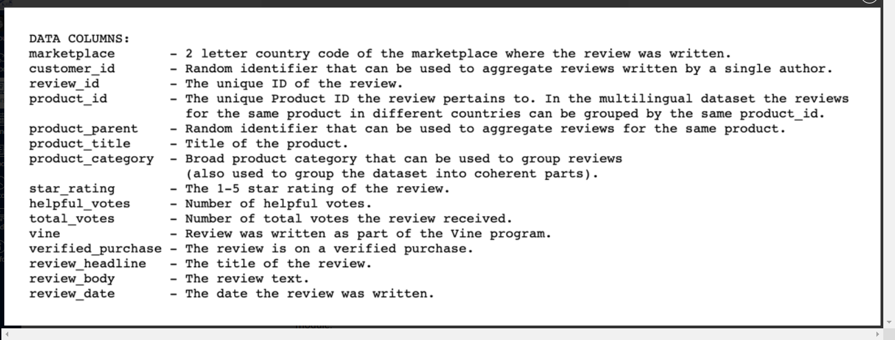
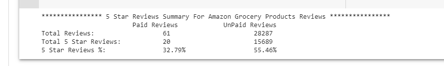

# Amazon Vine reviews analysis

Analyze Amazon reviews written by members of the paid Amazon Vine program. Here is the link to all [Amazon vine reviews sample datasets](https://s3.amazonaws.com/amazon-reviews-pds/tsv/index.txt)

## Project Overview:
The Amazon Vine program is a service that allows manufacturers and publishers to receive reviews for their products. Companies  pay a small fee to Amazon and provide products to Amazon Vine members, who are then required to publish a review.

The objective is to determine if there is any bias toward favorable reviews from Vine members in the selected dataset.   

## Resources:

### Data:
- we are using Grocery product reviews. 
[Amazon vine reviews grocery dataset](https://s3.amazonaws.com/amazon-reviews-pds/tsv/amazon_reviews_us_Grocery_v1_00.tsv.gz)

### Data Defintions:

### Software:
1. Google Collab
2. Spark version 3.1.1
3. PySpark
4. AWS postgress RDS
5. Python 3.7

### Solution overview : 

In this project, we are using PySpark to perform the ETL process to extract the dataset, transform the data, connect to an AWS RDS instance, and load the transformed data into Postgress RDS instance in AWS. 

In additin, using PySpark DataFrames analyize the vine reviews to understand if there is a bias for paid review.

In order to anaylyze if there is any bias on rating from paid vine reviews. We looked at only those reviews which has received at least 20 votes from other rviewers or buyers and marked as helpful reviews.The analysis was focused on those reviews which were deemed helpful by at least 50% of votres/reviewers/buyers.

## Results:

Using views for grocery products which has received at least 20 total votes. We found following facts:

-   There are 61 vine (paid) reviews while 28,287 are non-vine( unpaid) reviews.
-   There are 20 reviews out of 60 paid reviews have 5 star rating, while there are 15,689 5 star ratng from unpaid reviews.
- Vine(Paid) reivews have 32.79% 5-star ratings, while 55.46% ratings are 5-star from non vine(unpaid) review.

See below screenshot from the data.

## Summary:

Based on the result mentioned we can conlcude that paid reviews are not biased. This is also confirmed based on the number of paid reivews are far less compared to un paid reviews. 

However , we should further confirm this conclusion by:
1. The sample size for unpaid is quite low,so we should either reduce the filter critera for total votes from 20 to a lower value like 10 or 5. In addition reduce the 50% helpful votes to a lower threshold like to 25%
2. We only use 5 start rating , however we can check if 4 star or higher rating would still give similar results.
3. we can also use Pyspark machine learning to model the imapct on rating if review is paid.
